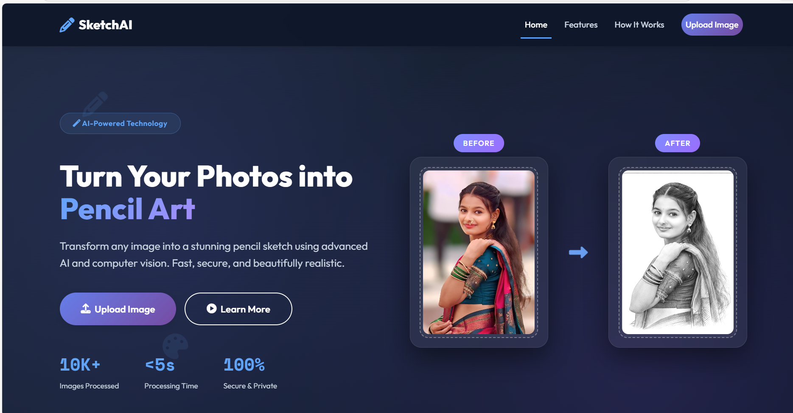
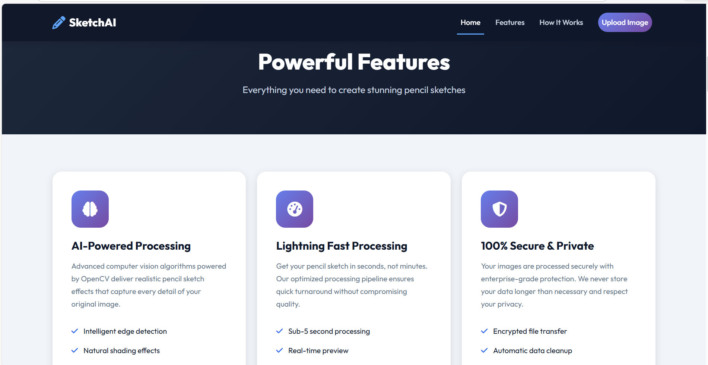
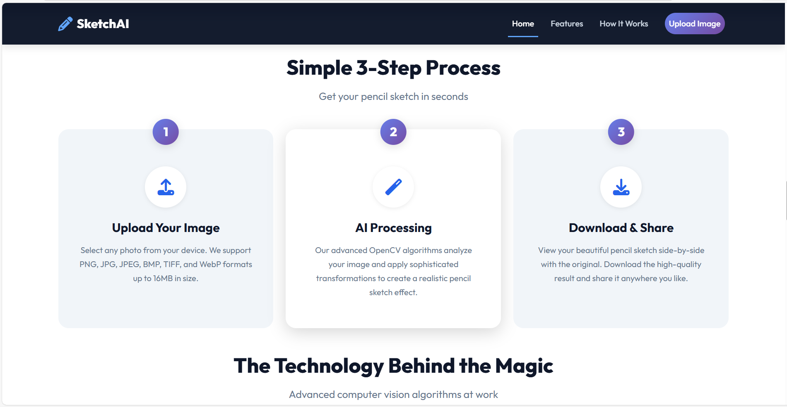
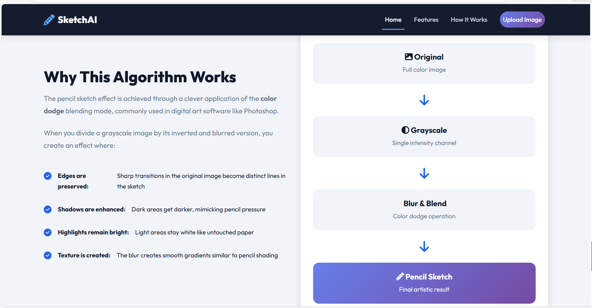
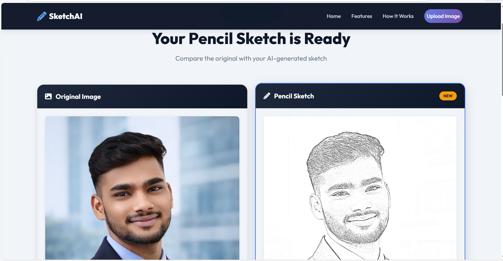
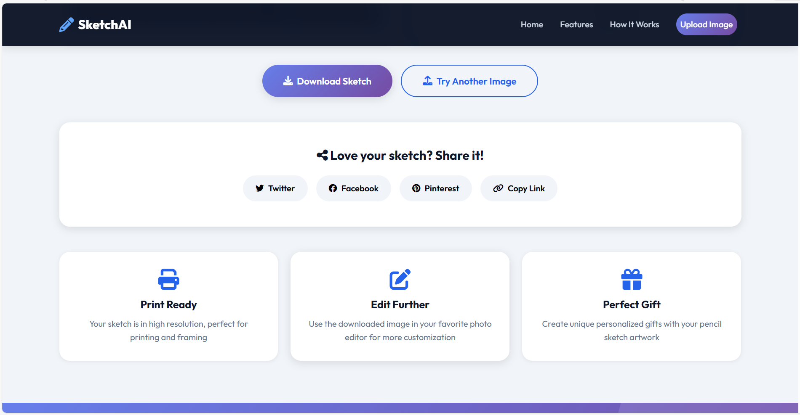

# 🎨 SketchAI - AI-Based Image to Pencil Sketch Generation

<div align="center">
    
[](https://www.python.org/)
[](https://flask.palletsprojects.com/)
[](https://developer.mozilla.org/en-US/docs/Web/HTML)
[](https://developer.mozilla.org/en-US/docs/Web/CSS)
[](https://getbootstrap.com/)
[](https://developer.mozilla.org/en-US/docs/Web/JavaScript)
[](https://www.sqlite.org/)


</div>

A production-ready web application that transforms your photos into stunning pencil sketches using advanced computer vision algorithms powered by OpenCV.

---

## 📋 Website Screenshots

- Home Page


- Features


- How it works


- Algorithm


- Output


- Sharing Options


---

## ✨ Features

### Core Features
- 🖼️ **AI-Powered Conversion**: Advanced OpenCV algorithms for realistic pencil sketch effects
- ⚡ **Lightning Fast**: Process images in under 5 seconds
- 🔒 **100% Secure**: Encrypted file transfers and automatic data cleanup
- 📱 **Responsive Design**: Works perfectly on desktop, tablet, and mobile devices
- 🎨 **High Quality Output**: Print-ready, high-resolution sketches
- 💾 **Instant Download**: One-click download of generated sketches

### Technical Features
- Multi-step image processing pipeline
- Grayscale conversion and image inversion
- Gaussian blur blending
- Edge enhancement and sharpening
- Support for multiple image formats (PNG, JPG, JPEG, BMP, TIFF, WebP)
- File size validation (max 16MB)
- SQLite database for conversion history
- Secure filename handling
- Error handling and validation

### UI/UX Features
- Modern, AI-themed interface
- Smooth animations and transitions
- Drag-and-drop file upload
- Real-time image preview
- Loading animations
- Flash messages for user feedback
- Side-by-side comparison view
- Social sharing options

---

## 🛠️ Technology Stack

### Backend
- **Python 3.8+**: Core programming language
- **Flask 3.0.0**: Web framework
- **OpenCV 4.8.1**: Computer vision library for image processing
- **NumPy**: Numerical computing
- **SQLite**: Database for conversion history

### Frontend
- **HTML5**: Semantic markup
- **CSS3**: Custom styling with CSS variables
- **Bootstrap 5.3.2**: Responsive framework
- **JavaScript (ES6+)**: Interactive functionality
- **Font Awesome 6.4.0**: Icons
- **Google Fonts**: Typography (Outfit, Space Mono)

### Additional Tools
- **Werkzeug**: WSGI utility library
- **Pillow**: Python Imaging Library
- **python-dotenv**: Environment variable management

---

## 🔬 How It Works

SketchAI uses a sophisticated multi-step algorithm to convert images into pencil sketches:

### Algorithm Steps

1. **Image Loading**: Read the uploaded image using OpenCV
2. **Grayscale Conversion**: Convert RGB image to grayscale
3. **Image Inversion**: Invert the grayscale image (negative)
4. **Gaussian Blur**: Apply blur to create smooth shading
5. **Blur Inversion**: Invert the blurred image
6. **Color Dodge Blending**: Divide grayscale by inverted blur
7. **Edge Enhancement**: Apply sharpening filter for crisp lines
8. **Save Output**: Export high-quality PNG

### Mathematical Basis

The core technique uses the **color dodge blending mode**:

```
sketch = (grayscale / (255 - blurred)) × 256
```

This creates an effect where:
- **Edges are preserved** as distinct pencil lines
- **Shadows are enhanced** mimicking pencil pressure
- **Highlights remain bright** like untouched paper
- **Texture is natural** with smooth gradients

---

## 📁 Project Structure

```
image_to_sketch_app/
│
├── app.py                      # Main Flask application
├── requirements.txt            # Python dependencies
├── sketch.db                   # SQLite database (auto-generated)
├── README.md                   # Project documentation
│
├── static/                     # Static assets
│   ├── css/
│   │   └── style.css          # Custom styles
│   ├── js/
│   │   └── main.js            # JavaScript functionality
│   ├── uploads/               # User uploaded images
│   └── outputs/               # Generated sketches
│
└── templates/                  # HTML templates
    ├── index.html             # Home page
    ├── features.html          # Features page
    ├── about.html             # How It Works page
    ├── upload.html            # Upload page
    └── result.html            # Result display page
```

---

## 🚀 Installation

### Prerequisites

- Python 3.8 or higher
- pip (Python package manager)
- Virtual environment (recommended)

### Step-by-Step Installation

1. **Clone or Download the Repository**
   ```bash
   cd image_to_sketch_app
   ```

2. **Create Virtual Environment (Recommended)**
   ```bash
   # On Windows
   python -m venv venv
   venv\Scripts\activate

   # On macOS/Linux
   python3 -m venv venv
   source venv/bin/activate
   ```

3. **Install Dependencies**
   ```bash
   pip install -r requirements.txt
   ```

4. **Verify Installation**
   ```bash
   python -c "import cv2; import flask; print('All dependencies installed successfully!')"
   ```

---

## 💻 Usage

### Running the Application

1. **Start the Flask Server**
   ```bash
   python app.py
   ```

2. **Access the Application**
   - Open your web browser
   - Navigate to: `http://localhost:5000`
   - Or: `http://127.0.0.1:5000`

3. **Upload and Convert**
   - Click "Upload Image" in the navigation
   - Drag and drop an image or click to browse
   - Click "Generate Sketch"
   - Download your pencil sketch!

### Production Deployment

For production deployment, use a WSGI server:

```bash
# Install gunicorn
pip install gunicorn

# Run with gunicorn
gunicorn -w 4 -b 0.0.0.0:5000 app:app
```

---

## 🌐 API Endpoints

| Endpoint | Method | Description |
|----------|--------|-------------|
| `/` | GET | Home page |
| `/features` | GET | Features page |
| `/how-it-works` | GET | About/How It Works page |
| `/upload` | GET, POST | Upload form and processing |
| `/result` | GET | Display results |
| `/download/<filename>` | GET | Download generated sketch |

---

## 🧮 Algorithm Explained

### Grayscale Conversion
```python
gray_img = cv2.cvtColor(img, cv2.COLOR_BGR2GRAY)
```
Converts the RGB image to single-channel grayscale.

### Image Inversion
```python
inverted_img = 255 - gray_img
```
Creates a negative of the image.

### Gaussian Blur
```python
blurred = cv2.GaussianBlur(inverted_img, (21, 21), 0)
```
Applies blur with a 21×21 kernel for smooth shading.

### Color Dodge Blending
```python
pencil_sketch = cv2.divide(gray_img, inverted_blurred, scale=256.0)
```
The key operation that creates the pencil effect.

### Edge Enhancement
```python
kernel_sharpening = np.array([[-1, -1, -1],
                               [-1,  9, -1],
                               [-1, -1, -1]])
pencil_sketch = cv2.filter2D(pencil_sketch, -1, kernel_sharpening)
```
Sharpens edges for crisp pencil lines.

---

## 📸 Screenshots

### Home Page
![Home Page Placeholder]
*Modern, AI-themed landing page with hero section*

### Upload Interface
![Upload Page Placeholder]
*Drag-and-drop upload with real-time preview*

### Results Page
![Results Page Placeholder]
*Side-by-side comparison of original and sketch*

### Features Overview
![Features Page Placeholder]
*Comprehensive feature cards with detailed descriptions*

---

## 🎯 Use Cases

- **Personal Art**: Transform family photos into artistic sketches
- **Gifts**: Create unique, personalized gifts
- **Social Media**: Share artistic versions of your photos
- **Portfolios**: Add artistic elements to design portfolios
- **Education**: Learn about computer vision and image processing
- **Commercial**: Create sketch-style marketing materials

---

## 🔧 Configuration

### Environment Variables

Create a `.env` file for sensitive configuration:

```env
SECRET_KEY=your-secret-key-here
MAX_CONTENT_LENGTH=16777216  # 16MB in bytes
DEBUG=False
```

### Customizing the Algorithm

Modify `app.py` to adjust the sketch effect:

```python
# Change blur kernel size (higher = softer strokes)
blurred = cv2.GaussianBlur(inverted_img, (31, 31), 0)

# Adjust division scale (higher = lighter sketch)
pencil_sketch = cv2.divide(gray_img, inverted_blurred, scale=300.0)
```

---

## 🐛 Troubleshooting

### Common Issues

**Issue**: `ModuleNotFoundError: No module named 'cv2'`
- **Solution**: Install OpenCV: `pip install opencv-python`

**Issue**: Upload fails with large images
- **Solution**: Increase `MAX_CONTENT_LENGTH` in `app.py`

**Issue**: Sketches appear too dark/light
- **Solution**: Adjust the `scale` parameter in `cv2.divide()`

**Issue**: Port 5000 already in use
- **Solution**: Change port in `app.py`: `app.run(port=8000)`

---

## 🤝 Contributing

Contributions are welcome! Here's how:

1. Fork the repository
2. Create a feature branch (`git checkout -b feature/AmazingFeature`)
3. Commit your changes (`git commit -m 'Add some AmazingFeature'`)
4. Push to the branch (`git push origin feature/AmazingFeature`)
5. Open a Pull Request

### Development Guidelines

- Follow PEP 8 style guide for Python code
- Add comments for complex algorithms
- Test thoroughly before submitting
- Update documentation as needed

---

## 📝 License

This project is licensed under the MIT License - see the LICENSE file for details.

---

## 🙏 Acknowledgments

- **OpenCV Community**: For the powerful computer vision library
- **Flask Team**: For the lightweight web framework
- **Bootstrap**: For the responsive CSS framework
- **Font Awesome**: For the beautiful icons

---

## 📧 Contact

For questions, suggestions, or issues:
- Open an issue on GitHub
- Email: rutikapardhi31@gmail.com

---

## 🚀 Future Enhancements

- [ ] Batch processing for multiple images
- [ ] Adjustable sketch intensity slider
- [ ] Different artistic styles (charcoal, ink, etc.)
- [ ] User accounts and history
- [ ] API for programmatic access
- [ ] Mobile app (React Native)
- [ ] Cloud storage integration
- [ ] Real-time preview with adjustments

---

## 📊 Performance

- **Processing Time**: < 5 seconds for most images
- **Supported File Size**: Up to 16MB
- **Supported Formats**: PNG, JPG, JPEG, BMP, TIFF, WebP
- **Output Format**: PNG (high quality)
- **Max Resolution**: Limited only by available memory

---

## 🎓 Educational Value

This project demonstrates:
- Flask web application development
- OpenCV image processing techniques
- Frontend-backend integration
- File upload handling
- Database operations with SQLite
- Responsive web design
- Modern UI/UX principles

Perfect for:
- Computer Science students
- Web development learners
- Image processing enthusiasts
- Portfolio projects

---

<div align="center">

**Built with ❤️ using Flask, OpenCV, and AI**

⭐ Star this repository if you found it helpful!

[Report Bug](https://github.com/yourusername/sketchai/issues) · [Request Feature](https://github.com/yourusername/sketchai/issues)

</div>
